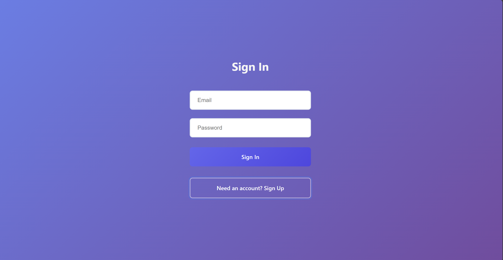
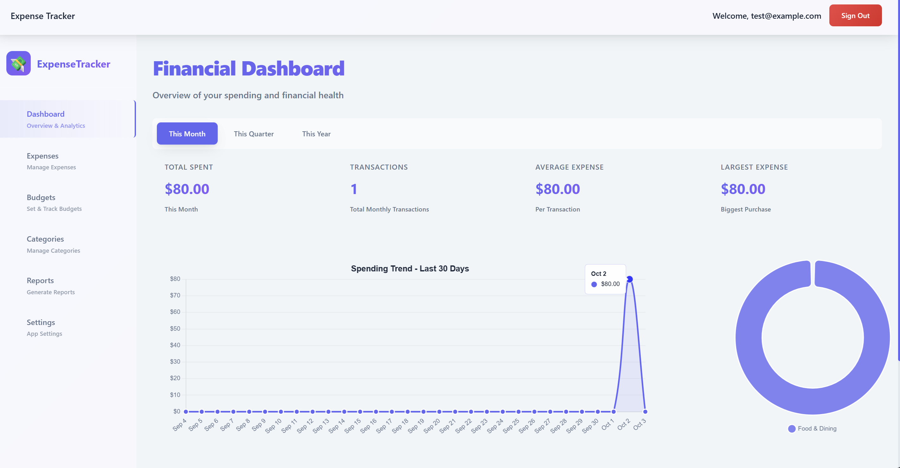
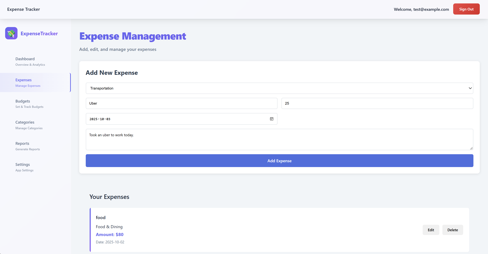
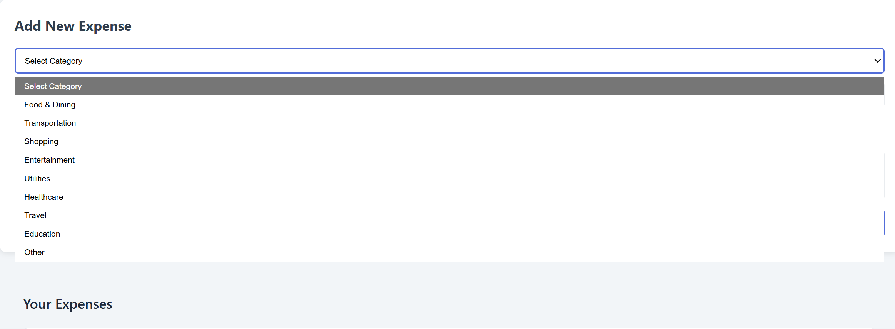

# Expense Tracker - Full Documentation

## Live Demo
[View Live Application](https://expense-tracker-pranay.netlify.app)

## Application Screenshots

### User Authentication

*User registration with form validation*

*Secure login interface*

### Main Application

*Expense dashboard with category filtering*

*Add expense form with category dropdown*

*Available expense categories*

## Documentation
- [Architecture Overview](./ARCHITECTURE.md)
- [Security Model](./SECURITY.md)
- [Deployment Guide](./DEPLOYMENT.md)
- [API Documentation](./API.md)
- [Setup Guide](./SETUP.md)